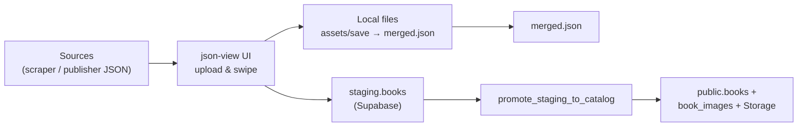

# JSON View — Catalog ingestion & curation (Lumina)


---

## What this tool is (in plain language)

**JSON View** is an **internal operator tool** for the Lumina bookstore platform. It helps you turn **raw product lists from the web** (or from publisher JSON feeds) into **clean, reviewed catalog rows** that can be loaded into your **Supabase** database—the same database that powers the customer website, mobile apps, admin back office, and shop POS.

In one sentence: **you upload scraped product data as JSON, swipe through each item like a review queue, accept the good rows, then either save a merged file on disk or push the approved data straight into your live catalog.**

You do **not** need to be a developer to use the day-to-day flow: open the app, load a file, tap Accept or Reject, then Save and Merge. Developers set up environment variables, Supabase, and optional automation (cron, AI keys).

---

## Why it exists

Online bookshops and wholesalers expose products in HTML or JSON. Copy-pasting is slow and error-prone. This tool gives you:

- **Validation** — Each row must match a shared schema (`ScrapedBook`) so bad data is caught early.
- **Human review** — One item at a time so operators can spot junk listings before they hit production.
- **Deduplication** — Same **source + SKU** is merged so duplicates do not multiply.
- **Two deployment modes** — Work **fully offline on your laptop** (files only), or **connected to Supabase** (staging → live catalog, cover images in Storage).
- **Multi-source support** — Different catalogs (e.g. Rasakatha vs a publisher feed) are tagged with `catalog_source` so SKUs do not collide.
- **Optional automation** — Scheduled HTTP snapshots and CLI scrape reports can record counts and alert when batch sizes jump.
- **Optional AI** — One click can suggest a **category label** and **short description** for the current row (OpenAI-compatible API).

Detailed platform context lives in the [root README](../README.md).

---

## The two parts of this folder

| Part | What it does |
| --- | --- |
| **`rasakatha-scraper/`** (Python) | Crawls **rasakatha.lk** shop pages and writes `output/products.json` and `products.csv`. This is *one* example data source—you can also build other scrapers or use a publisher’s JSON URL. |
| **`src/`** (Next.js web app) | The **curation UI** plus **API routes** that save chunks, merge, talk to Supabase, re-host cover URLs, run AI enrichment, and (when configured) accept cron/snapshot reports. |

Together they form the **ingestion pipeline**: **collect → review → persist → merge → catalog**.

---

## How the flow works (step by step)

### A. Get data into the UI

1. Run the scraper (or produce any JSON array that matches the `ScrapedBook` shape—see [`packages/shared-types`](../packages/shared-types)).
2. Start the web app (`pnpm run dev` from this folder, or `pnpm run dev:json-view` from the repo root).
3. **Upload** `products.json`. Invalid rows are skipped with a message; valid rows enter the queue.

### B. Review each product

4. For each item you see **title, price, image, description**, etc.
5. Press **Reject** to skip without saving, or **Accept** to add it to your “save batch”.
6. Optional: if the server has **`OPENAI_API_KEY`**, use **AI suggest** to fill **category** and **description** for the *current* row—always review before accepting.

### C. Save approved rows

7. **Save batches** sends your accepted items to:
   - **Local mode** (no Supabase URL in env): JSON chunks under `assets/save/{n}.json` (chunk size from **`JSONVIEW_SAVE_CHUNK_SIZE`**, default 50).
   - **Supabase mode** (`NEXT_PUBLIC_SUPABASE_URL` + anon key): upsert into **`staging.books`**, keyed by **`catalog_source` + source_sku** (native SKU in the payload).

### D. Finalize into the catalog

8. **Merge**:
   - **Local**: reads all chunks, dedupes, writes **`output/merged.json`**, then tries to open the output folder (cross-platform when implemented in the `open-folder` route).
   - **Supabase**: runs **`promote_staging_to_catalog()`**, which upserts **`public.books`**, attaches **authors/publishers** as needed, sets **`book_images`**, and writes a **namespaced** `source_sku` like `rasakatha:SKU123`. Then external cover **http(s)** URLs are re-uploaded to the **`book-covers`** bucket when your admin policies allow.

9. Optional: import `merged.json` elsewhere (e.g. [`book-store-brain`](../book-store-brain/README.md) **Import from JSON View** route) if you use file-based handoff.

---

## Picture of the pipeline



---

## Who should use what

| Role | Typical use |
| --- | --- |
| **Catalog operator** | Runs the UI, reviews items, saves and merges; may use AI suggest. |
| **Developer / DevOps** | Configures `.env`, Supabase migrations, cron to `/api/catalog/cron-ingest`, service role for scheduled jobs, `OPENAI_API_KEY` if using AI. |
| **Data from other apps** | [`book-store-brain`](../book-store-brain/README.md) includes **Catalog Data Quality** (completeness + recent ingest runs)—that dashboard is **not** inside this folder but depends on the same Supabase schema. |

---

## Environment variables (reference)

Copy [`.env.example`](.env.example) to **`.env.local`** for local development.

| Variable | Purpose |
| --- | --- |
| `NEXT_PUBLIC_SUPABASE_URL` | If set (with anon key), Save/Merge use Supabase and **write APIs require an admin Supabase session** (see Security). |
| `NEXT_PUBLIC_SUPABASE_ANON_KEY` | Public anon key for the browser/server Supabase client. |
| `JSONVIEW_SAVE_CHUNK_SIZE` | Local save chunk size (default 50). |
| `SUPABASE_SERVICE_ROLE_KEY` | Server-only. Used by **`/api/catalog/cron-ingest`** to read/write catalog tables from a scheduled job—**never** expose to the browser. |
| `JSONVIEW_CRON_SECRET` | Shared secret header for cron POSTs to **`/api/catalog/cron-ingest`**. |
| `JSONVIEW_WORKER_SECRET` | Shared secret for **`POST /api/catalog/ingest-jobs/:id/worker`** (VM / OCI worker). |
| `OPENAI_API_KEY` | Enables **AI suggest** and **`/api/ai/enrich`**. |
| `OPENAI_BASE_URL` / `OPENAI_MODEL` | Optional; default OpenAI endpoint and `gpt-4o-mini`. |
| **Scraper**: `RASAKATHA_MAX_PAGES`, `RASAKATHA_DELAY_SECONDS`, `RASAKATHA_REQUEST_TIMEOUT`, **`CATALOG_SOURCE`** (slug stored on each row, default `rasakatha`). |

---

## API routes (summary)

| Route | Role |
| --- | --- |
| `POST /api/save` | Save accepted batch (local chunks or `staging.books`). |
| `POST /api/merge` | Local merge to `merged.json`, or Supabase promote + cover re-host. |
| `POST /api/open-folder` | Open output folder after **local** merge. |
| `POST /api/catalog/cron-ingest` | Service role + `JSONVIEW_CRON_SECRET`—scheduled HTTP catalog snapshots. |
| `POST /api/catalog/snapshot-report` | Admin—report CLI scrape row counts for diff/alert metrics. |
| `GET` / `POST /api/ai/enrich` | `GET` checks if AI is configured; `POST` returns suggested category + summary for a row. |
| `GET` / `POST /api/catalog/ingest-jobs` | **Phase 5** — Admin: list jobs (`?status=&limit=`), create job (`catalog_source`, `config`, `parts_total`, …). |
| `GET` / `PATCH /api/catalog/ingest-jobs/:jobId` | Admin: job + parts; `GET ?include_payload=1` returns part JSON; `PATCH` body `{ "status": "cancelled" }`. |
| `POST /api/catalog/ingest-jobs/:jobId/worker` | **Phase 5** — **`JSONVIEW_WORKER_SECRET`** + **`SUPABASE_SERVICE_ROLE_KEY`** on server: heartbeat, upload part (`ScrapedBook[]`), complete, fail. |
| `PATCH /api/catalog/ingest-jobs/:jobId/parts/:partIndex` | Admin: mark part **`imported`** or **`skipped`** after staging import (Phase 7 can wire UI). |

Implementation files live under `src/app/api/`.

---

## Project layout (updated)

```text
json-view/
├── src/app/
│   ├── page.tsx                 # Swipe / accept-reject UI (+ AI suggest)
│   └── api/
│       ├── save/route.ts
│       ├── merge/route.ts
│       ├── open-folder/route.ts
│       ├── ai/enrich/route.ts
│       └── catalog/
│           ├── cron-ingest/route.ts
│           ├── snapshot-report/route.ts
│           └── ingest-jobs/     # Phase 5 job + worker + part status
├── src/lib/                     # auth, dedupe, worker auth, admin DB helper, catalog snapshots, AI
├── rasakatha-scraper/
├── assets/save/                 # local batch chunks (gitignored in practice)
├── output/merged.json           # local final artifact
├── samples/                     # example publisher JSON
└── README.md                    # this file
```

Shared **`ScrapedBook`** schema and validation: [`packages/shared-types`](../packages/shared-types).

---

## How to run (commands)

**Web app** (from repo root, recommended):

```bash
pnpm install
pnpm run dev:json-view    # http://localhost:3000 — port may differ if shared workspace
```

From **this directory only**:

```bash
pnpm install
pnpm run dev
pnpm run build
pnpm run lint
pnpm run typecheck
```

**Scraper**:

```bash
cd rasakatha-scraper
python -m venv .venv
# Windows: .venv\Scripts\Activate.ps1
pip install -r requirements.txt
python scraper.py
```

Output: `rasakatha-scraper/output/products.json` and `.csv`.

---

## What “Phase 0–5” delivered (capabilities)

Shipped roadmap phases for this tool are **implemented** through **Phase 5**. Here is what each phase **means for you**:

- **Phase 0 — Basics** — Zod validation (`partitionScrapedBooks`), dedupe by **source + SKU**, scraper env controls (`RASAKATHA_*`, chunk size), cross-platform open-folder behavior where implemented.
- **Phase 1 — Supabase & auth** — When Supabase env is set, **write APIs require** a signed-in user with **`app_metadata.role === "admin"`**. Curated rows land in **`staging.books`**.
- **Phase 2 — Promote & covers** — **Merge** calls **`promote_staging_to_catalog()`** to fill **`public.books`**, **`book_images`**, normalize authors/publishers, and re-host remote covers into **`book-covers`** when allowed.
- **Phase 3 — Multi-source & observability** — Each row has **`catalog_source`**; staging is unique on `(catalog_source, source_sku)`; **`catalog_sources`**, **`catalog_scrape_runs`**, **`catalog_diff_alerts`** support scheduled **`/api/catalog/cron-ingest`** and CLI **`/api/catalog/snapshot-report`**. Optional **pg_cron** POST example is documented below.
- **Phase 4 — AI & quality dashboard** — **`/api/ai/enrich`** + **AI suggest** in the UI (needs **`OPENAI_API_KEY`**). In **book-store-brain**, **Catalog Data Quality** uses RPC **`catalog_data_quality_stats`** (see migration `20260427200000_phase4_catalog_quality_stats.sql`).
- **Phase 5 — Job API + storage contract** — Tables **`catalog_ingest_jobs`** and **`catalog_ingest_job_parts`** (migration `20260428120000_jsonview_phase5_ingest_jobs.sql`): admin creates/lists jobs; workers (OCI VM, etc.) **`POST`** heartbeats and **`ScrapedBook[]`** chunks to **`/api/catalog/ingest-jobs/:id/worker`** using **`JSONVIEW_WORKER_SECRET`**; parts store JSON in **`payload_json`** (signed object storage URLs are a later optional enhancement).

---

## Roadmap: cloud-hosted scraping, chunked review, and lowest-price sourcing (Phase 5+)

**Short answer:** Yes — the workflow you described is **architecturally normal**: a **frontend on Vercel** (short-lived serverless), a **24/7 worker** elsewhere (Python), **durable storage** for JSON and progress, and **Supabase** as the system of record for merge, approval, and live catalog. Nothing here requires magic; it is **engineering work** split into phases.

**Oracle Cloud (OCI)** is **one** way to run Python 24/7: a small **Compute VM** (virtual machine) or **Container Instances** job that stays up, respects **rate limits / delays** between requests, and writes results to **Object Storage** (folder-per-website) or posts back to your API. Alternatives with similar patterns: **Fly.io**, **Railway**, **Render**, **DigitalOcean Droplet**, **AWS Lightsail**, **Hetzner VPS** — pick by **price, region, and comfort**, not brand alone.

### What you want (mapped to components)

| Goal | Typical implementation |
| --- | --- |
| PC does not need to stay on | Long-running **worker** on a VM/container host; **queue** or **DB rows** for jobs |
| Submit any website URL + delay | Worker reads **job config** (URL, `catalog_source`, delay, max pages); respects **robots.txt** and site **Terms of Service** (your responsibility) |
| Frontend shows “still running” + ETA | Worker writes **heartbeat + counters** (e.g. Supabase `catalog_scrape_runs` or a `ingest_jobs` table); UI polls or uses **Realtime** |
| Save JSON per website in “folders” | **Object storage** bucket paths like `sources/{slug}/run-{id}/part-001.json` (OCI Object Storage, S3-compatible, or Supabase Storage) |
| Split into N parts (e.g. 50) in cloud | Worker **chunks** output server-side; metadata table lists **parts** and status (`pending` / `ready` / `imported`) |
| Review part-by-part over days | UI lists parts; operator **imports** accepted parts into **`staging.books`** incrementally (today: upload / save batches; future: bind each part to a **job id**) |
| Multiple websites, then merge duplicates | **ISBN** + **fuzzy title** matching in admin or SQL; **merge** UI writes one canonical **`public.books`** row (see [book-store-brain README](../book-store-brain/README.md) Phase 5+ section) |
| Approve to live, edit, media | Already aligned with **staging → promote** and admin routes; extend with richer **media** and **description** tasks |
| “Lowest price across sources” for buying | Store **list_price** (or cost) **per source** on staging or a **`catalog_offers`** table; admin **view** = `MIN(price)` grouped by **canonical book** — business logic only after you define **SKU / ISBN** join rules |

### Phased plan (recommended order)

| Phase | Scope | You provide |
| --- | --- | --- |
| **5 — Job API + storage contract** | **Shipped:** Supabase tables + routes above; worker **server ingest** of `ScrapedBook[]` per **part_index**; admin part status **`imported` / `skipped`**. Signed upload URLs → optional later. | Apply migration; set **`JSONVIEW_WORKER_SECRET`** + **`SUPABASE_SERVICE_ROLE_KEY`** on json-view deploy |
| **6 — Worker service** | Python container or VM: dequeue job, scrape with delay, write parts + progress | **OCI account** (or other), **SSH keys**, billing alert threshold; **secrets** for Supabase service role or HMAC to your API |
| **7 — json-view / brain UI** | Job dashboard: progress, ETA, list parts, “import this part”, resume next day | UX priorities (which screens first) |
| **8 — Dedupe & merge** | Cross-source ISBN / title similarity, operator **merge** before promote | Rules: when to auto-suggest vs manual only |
| **9 — Procurement pricing** | Lowest offer per canonical product + margin fields | Legal/commercial definition of “same product” |

### If you choose Oracle Cloud specifically (non-developer checklist)

1. **Sign up** for Oracle Cloud Infrastructure and verify **Always Free** vs paid limits (free tier changes over time — confirm in OCI docs).
2. Create a **VCN** (virtual network) and a **small Linux VM** (Ubuntu is common) or use **OCI Container Instances** if you prefer containers.
3. Create an **Object Storage** bucket for raw JSON; optionally use **pre-authenticated requests** or **instance principal** so the VM can write without embedding long-lived keys in code.
4. Put **Python + your scrapers** on the VM (or in a container image), use **systemd** or **supervisord** so the process restarts on reboot.
5. **Never** expose the Supabase **service role** key on a public repo; inject via **OCI Vault** or environment on the VM only.

### OCI Ubuntu VM — after the instance exists (step-by-step)

1. **Networking (or SSH will hang)**  
   In OCI: **Networking → Virtual cloud networks → your subnet → Security lists** (or the NSG on the instance). Add an **ingress** rule: **TCP port 22**, source `0.0.0.0/0` (narrow to your home IP later if you want). Some wizards only open SSH to the **VCN**; the instance must be in a **public subnet** with a **public IP** assigned, or use **OCI Bastion**.

2. **SSH from your PC**  
   Ubuntu images usually log in as **`ubuntu`**. Use the **private key** that matches the **public key** you pasted when creating the instance:

   ```bash
   ssh -i path/to/your-key.pem ubuntu@YOUR_PUBLIC_IP
   ```

   If login fails, check the instance **image** documentation in OCI for the default user (`ubuntu` vs `opc`).

3. **System packages**

   ```bash
   sudo apt update && sudo apt upgrade -y
   sudo apt install -y git python3 python3-venv python3-pip
   ```

4. **Get the scraper onto the VM** (pick one)  
   - **Git:** clone your monorepo (or a copy that contains `json-view/rasakatha-scraper`).  
   - **No git remote:** from your PC, zip `rasakatha-scraper` and **SCP** it up, then `unzip` on the VM.

5. **Python venv and first test run**

   ```bash
   cd rasakatha-scraper   # or json-view/rasakatha-scraper inside the repo
   python3 -m venv .venv
   source .venv/bin/activate
   pip install -r requirements.txt
   export RASAKATHA_MAX_PAGES=2
   export RASAKATHA_DELAY_SECONDS=2
   python scraper.py
   ```

   Confirm **`output/products.json`** appears. Then remove or unset **`RASAKATHA_MAX_PAGES`** for a full run.

6. **Keep it running after you disconnect (optional)**  
   Use **`tmux`** or **`screen`** for a quick session, or create a **`systemd`** unit that runs `scraper.py` on boot (recommended once stable). Example pattern: `WorkingDirectory=/home/ubuntu/rasakatha-scraper`, `ExecStart=/home/ubuntu/rasakatha-scraper/.venv/bin/python scraper.py`, `Environment=RASAKATHA_DELAY_SECONDS=2`.

7. **Next upgrades (your master plan)**  
   Storing JSON in **OCI Object Storage**, posting progress to **Supabase**, and triggering from **Vercel** are **Phase 5+** — the VM you have is the right place to run Python; wire APIs and buckets when you are ready.

**Legal note:** Scraping third-party sites can violate their terms or local law. Prefer **official feeds**, **APIs**, or **written permission** where possible.

Admin-side narrative (approval, merge, media, **lowest-price** dashboard) lives in **[`book-store-brain/README.md`](../book-store-brain/README.md)** under the same Phase 5+ heading.

---

## Scheduled HTTP snapshots (optional, Phase 3)

1. Apply Supabase migrations (including `20260427180000_jsonview_phase3_multisource_cron.sql`).
2. Configure rows in **`public.catalog_sources`** (`fetch_url`, optional `fetch_headers`, thresholds, `enabled`).
3. Deploy json-view with **`JSONVIEW_CRON_SECRET`** and **`SUPABASE_SERVICE_ROLE_KEY`**.
4. Example **pg_cron** job that POSTs your deployed **`/api/catalog/cron-ingest`** (replace host and secret):

```sql
select cron.schedule(
  'lumina-jsonview-catalog-ingest',
  '0 5 * * *',
  $$
  select net.http_post(
    url := 'https://YOUR_HOST/api/catalog/cron-ingest',
    headers := jsonb_build_object(
      'Content-Type', 'application/json',
      'Authorization', 'Bearer ' || 'REPLACE_WITH_JSONVIEW_CRON_SECRET'
    ),
    body := '{}'::jsonb
  );
  $$
);
```

After a **CLI** scrape, operators can **`POST /api/catalog/snapshot-report`** with `{ "sourceSlug": "rasakatha", "rowCount": N }` (admin session).

---

## Security (read this before exposing the app to a network)

- **Local-only** (no Supabase URL): the API can write to **your machine’s disk** and trigger **open-folder** shell helpers—treat like a **trusted workstation tool**, not a public website.
- **With Supabase**: **save, merge,** and other **write** routes expect an **admin** Supabase session.
- **Never** commit **service role** keys or **cron secrets**; **`SUPABASE_SERVICE_ROLE_KEY`** is server-only.

---

## Troubleshooting (short)

| Symptom | What to check |
| --- | --- |
| Save returns 401/403 | Sign in as admin when using Supabase, or unset public Supabase env for pure local mode. |
| Merge fails on Supabase | JWT role, RLS, and that **`promote_staging_to_catalog`** migration is applied. |
| AI button missing | **`OPENAI_API_KEY`** not set on the server running json-view. |
| Cron ingest 401 | `Authorization: Bearer` matches **`JSONVIEW_CRON_SECRET`**. |
| Worker ingest 401 / 503 | **`JSONVIEW_WORKER_SECRET`** set and `Authorization: Bearer` (or **`X-Jsonview-Worker`**) matches; service role key present on server. |
| Data quality page errors | Apply **`catalog_data_quality_stats`** migration; sign in as admin in book-store-brain. |

---

## Related apps (same monorepo)

End consumers of catalog data: [bookstore-web](../bookstore-web/README.md), [books](../books/README.md) (mobile), [book-store-brain](../book-store-brain/README.md) (admin), [bookstore_pos](../bookstore_pos/README.md) (POS). Import paths from json-view include **book-store-brain** catalog import API where configured.

---

## Tech stack

- **UI:** Next.js 16, React 19, Tailwind 4, TypeScript strict.
- **Shared packages:** `@lumina/shared-types`, `@lumina/supabase-client`.
- **Scraper:** Python 3.10+, `requests`, `beautifulsoup4`, etc. (`rasakatha-scraper/requirements.txt`).

---

## Legacy sections (archived context)

Older “refactor checklist” and “current vs target” tables tracked progress before the phases above shipped; the behavior described in **this** README is the **current** behavior. If you embed a nested `.git` under `rasakatha-scraper/`, consider flattening to a normal folder so history stays in one repository.
